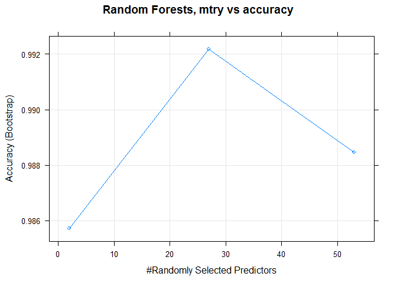
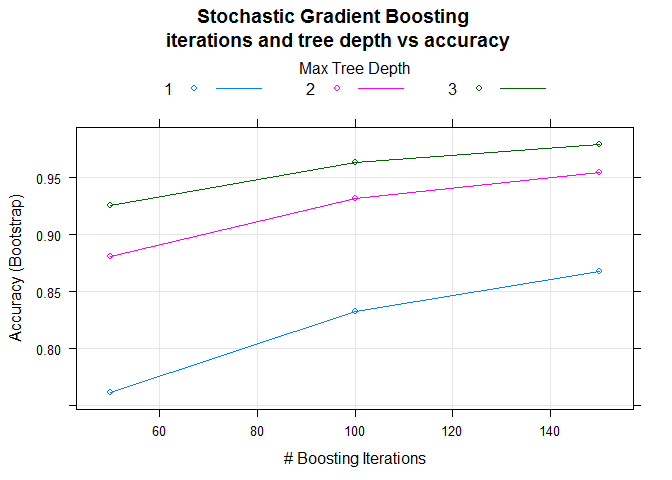

Executive Summary
-----------------

A unilateral dumbbell biceps curl was performed with multiple repititions across multiple subjects. Each rep is classified for correct execution or execution with one of four of the most common form errors. Data from five sensors placed on the subjects was collected. This data was reduced to instantaneous data only, discarding distribution data for each rep. Comparing machine learning techniques (stochastic gradient boosting, random forests, and linear discriminant analysis), we find that random forests offers the best predictions based on instantaneous motion sensor data. Random forests offers 99.5% out-of-sample accuracy; stochastic gradient boosting offers 98.6% out-of-sample accuracy; and linear discriminant analysis had only 70.6% out-of-sample accuracy. We then use the random forest model to predict the error class for twenty test observations.

Background
----------

Per Velloso, et al: "\[H\]uman activity recognition research has traditionally focused on discriminating between different activities, i.e. to predict "which" activity was performed at a specific point in time (like with the Daily Living Activities dataset above). The approach we propose for the Weight Lifting Exercises dataset is to investigate "how (well)" an activity was performed by the wearer. The "how (well)" investigation has only received little attention so far, even though it potentially provides useful information for a large variety of applications,such as sports training."

Velloso, et al provide data for many repititions of a unilateral dumbbell biceps curl across multiple subjects. Each repitition also has a "window" observation, describing motion analysis for the entire rep. (These include kurtosis, skewness, max, min, and amplitude of the collected data.) Every repitition is classified for correct form (Class A) or for falling into one of four common form errors (Classes B through E); a trainer was used to evaluate correct execution of form errors or lack thereof, with no compound form errors included in the data.

We are given 20 instantaneous data points for which we must predict the form classification. The raw data include 19622 observations of 160 variables, including "window" summary data.

Data Manipulation and Cleaning
------------------------------

The data are loaded directly from the internet. Because we must make our predictions based on instantaneous data, we must drop all "window" summary data. This includes rows for "window" data and columns that are missing values except for "window" rows. We will also drop data describing observations that we know do not influence form, including subject identification, row index, and timestamp.

``` r
training <- read.csv(url("https://d396qusza40orc.cloudfront.net/predmachlearn/pml-training.csv"))
testing <- read.csv(url("https://d396qusza40orc.cloudfront.net/predmachlearn/pml-testing.csv"))
training <- training[which(training$new_window!="yes"),]
training <- subset(training,select=-c(user_name, raw_timestamp_part_1, raw_timestamp_part_2,
                                      cvtd_timestamp, new_window))
training <- training[,colSums(is.na(training)) != nrow(training)]
training <- subset(training,select=-c(kurtosis_roll_belt,kurtosis_picth_belt,kurtosis_yaw_belt,
                                      skewness_roll_belt,skewness_roll_belt.1,skewness_yaw_belt,
                                      max_yaw_belt,min_yaw_belt,amplitude_yaw_belt))
training <- subset(training,select=-c(kurtosis_roll_arm,
                                      kurtosis_picth_arm,kurtosis_yaw_arm,skewness_roll_arm,
                                      skewness_pitch_arm,skewness_yaw_arm))
training <- subset(training,select=-c(kurtosis_roll_dumbbell,
                                      kurtosis_picth_dumbbell,kurtosis_yaw_dumbbell,
                                      skewness_roll_dumbbell,skewness_pitch_dumbbell,
                                      skewness_yaw_dumbbell,max_yaw_dumbbell,min_yaw_dumbbell,
                                      amplitude_yaw_dumbbell))
training <-  subset(training,select=-c(kurtosis_roll_forearm,kurtosis_picth_forearm,
                                       kurtosis_yaw_forearm,skewness_roll_forearm,
                                       skewness_pitch_forearm,skewness_yaw_forearm,
                                       max_yaw_forearm,min_yaw_forearm, amplitude_yaw_forearm))
training <- subset(training,select=-X)
```

This relatively clean dataset includes 19216 instantaneous observations of 53 possible covariates plus our classification variable.

Cross-validation: Preparation
-----------------------------

Because of the large dataset, the training algorithms will take a fair amount of time to compute a model. In consideration of that issue, we will use the holdout method of cross validation, dividing the provided data set into two equal-sized training and validation sets. The relatively large size of the validation set should represent out-of-sample error fairly well.

For more critical models or smaller datasets (or where computation time is less important), it would be advantageous to apply a k-folds method of cross-validation. (Even a two-fold cross-validation should improve outcomes.)

``` r
library(caret)
library(gbm)
library(AppliedPredictiveModeling)

set.seed(314159)
indexTrain = createDataPartition(training$classe, p = 1/2)[[1]]
trainset = training[ indexTrain,]
valset = training[-indexTrain,]
```

Model Creation
--------------

Using the `caret` package, we train three models using the stochastic gradient boosting, random forests, and linear discriminant analysis learning algorithms.

``` r
mod1 <- train(classe~.,data=trainset,method="gbm")
```

    ## Loading required package: plyr

``` r
mod2 <- train(classe~.,data=trainset,method="rf")
```

    ## Loading required package: randomForest

    ## Warning: package 'randomForest' was built under R version 3.3.3

    ## randomForest 4.6-12

    ## Type rfNews() to see new features/changes/bug fixes.

    ## 
    ## Attaching package: 'randomForest'

    ## The following object is masked from 'package:ggplot2':
    ## 
    ##     margin

``` r
mod3 <- train(classe~.,data=trainset,method="lda")
```

    ## Loading required package: MASS

We should evaluate these three models for in-sample error as a diagnostic.

``` r
predTr1 <- predict(mod1, trainset)
predTr2 <- predict(mod2, trainset)
predTr3 <- predict(mod3, trainset)
```

``` r
table(predTr1,trainset$classe)
```

    ##        
    ## predTr1    A    B    C    D    E
    ##       A 2733    4    0    0    0
    ##       B    3 1843   11    2    2
    ##       C    0   12 1664    9    1
    ##       D    0    0    1 1561   10
    ##       E    0    0    0    2 1751

``` r
sum(predTr1==trainset$classe)/length(trainset$classe)
```

    ## [1] 0.9940681

``` r
table(predTr2,trainset$classe)
```

    ##        
    ## predTr2    A    B    C    D    E
    ##       A 2736    0    0    0    0
    ##       B    0 1859    0    0    0
    ##       C    0    0 1676    0    0
    ##       D    0    0    0 1574    0
    ##       E    0    0    0    0 1764

``` r
sum(predTr2==trainset$classe)/length(trainset1$classe)
```

    ## [1] 1

``` r
table(predTr3,trainset$classe)
```

    ##        
    ## predTr3    A    B    C    D    E
    ##       A 2290  233  175   78   68
    ##       B   74 1240  135   65  247
    ##       C  152  236 1139  191  147
    ##       D  212   75  182 1176  187
    ##       E    8   75   45   64 1115

``` r
sum(predTr3==trainset$classe)/length(trainset$classe)
```

    ## [1] 0.7243209

We see that random forests outperforms both stochastic gradient boosting and linear discriminant analysis. With RF and GBM performing so well, with accuracy rates at or near 100%, we are prepared to continue with these two models.

We can investigate the model-building algorithms briefly for our top-two models.

### Random Forests



    ## Random Forest 
    ## 
    ## 9609 samples
    ##   53 predictor
    ##    5 classes: 'A', 'B', 'C', 'D', 'E' 
    ## 
    ## No pre-processing
    ## Resampling: Bootstrapped (25 reps) 
    ## Summary of sample sizes: 9609, 9609, 9609, 9609, 9609, 9609, ... 
    ## Resampling results across tuning parameters:
    ## 
    ##   mtry  Accuracy   Kappa    
    ##    2    0.9857070  0.9819097
    ##   27    0.9921896  0.9901156
    ##   53    0.9884495  0.9853830
    ## 
    ## Accuracy was used to select the optimal model using  the largest value.
    ## The final value used for the model was mtry = 27.

For building our random forests model, three values for the tuning parameter, `mtry`, were used. Additional values of `mtry` might be a useful way to improve the accuracy of this model. Tuning `mtry` would be an especially good application for k-fold cross-validation.

### Stochastic Gradient Boosting



    ## Stochastic Gradient Boosting 
    ## 
    ## 9609 samples
    ##   53 predictor
    ##    5 classes: 'A', 'B', 'C', 'D', 'E' 
    ## 
    ## No pre-processing
    ## Resampling: Bootstrapped (25 reps) 
    ## Summary of sample sizes: 9609, 9609, 9609, 9609, 9609, 9609, ... 
    ## Resampling results across tuning parameters:
    ## 
    ##   interaction.depth  n.trees  Accuracy   Kappa    
    ##   1                   50      0.7618458  0.6976591
    ##   1                  100      0.8323189  0.7876378
    ##   1                  150      0.8677352  0.8325700
    ##   2                   50      0.8807390  0.8489480
    ##   2                  100      0.9315722  0.9133853
    ##   2                  150      0.9544307  0.9423229
    ##   3                   50      0.9259139  0.9061887
    ##   3                  100      0.9631901  0.9534093
    ##   3                  150      0.9790589  0.9734981
    ## 
    ## Tuning parameter 'shrinkage' was held constant at a value of 0.1
    ## 
    ## Tuning parameter 'n.minobsinnode' was held constant at a value of 10
    ## Accuracy was used to select the optimal model using  the largest value.
    ## The final values used for the model were n.trees = 150,
    ##  interaction.depth = 3, shrinkage = 0.1 and n.minobsinnode = 10.

The stochastic gradient boosting model-building algorithm varied two tuning parameters, `interaction.depth` and `n.trees`. In-sample accuracy appeared to improve with increasing values for both of these parameters, but this trend could lead to overfitting. Tuning these variables would be another great application for k-folds cross-validation.

Cross-validation: Out-of-sample Error
-------------------------------------

``` r
predval1 <- predict(mod1,valset)
predval2 <- predict(mod2, valset)
predval3 <- predict(mod3, valset)
table(predval1, valset$classe)
```

    ##         
    ## predval1    A    B    C    D    E
    ##        A 2728   10    0    0    0
    ##        B    6 1824   25    8    1
    ##        C    0   21 1644   17    4
    ##        D    1    4    7 1547   26
    ##        E    0    0    0    1 1733

``` r
sum(predval1==valset$classe)/length(valset$classe)
```

    ## [1] 0.9863641

``` r
table(predval2, valset$classe)
```

    ##         
    ## predval2    A    B    C    D    E
    ##        A 2734   10    0    0    0
    ##        B    0 1843   18    0    0
    ##        C    0    6 1658    7    0
    ##        D    0    0    0 1566    7
    ##        E    1    0    0    0 1757

``` r
sum(predval2==valset$classe)/length(valset$classe)
```

    ## [1] 0.9948996

``` r
table(predval3, valset$classe)
```

    ##         
    ## predval3    A    B    C    D    E
    ##        A 2234  255  177   88   73
    ##        B   84 1219  172   69  246
    ##        C  175  231 1071  205  174
    ##        D  224   61  209 1155  163
    ##        E   18   93   47   56 1108

``` r
sum(predval3==valset$classe)/length(valset$classe)
```

    ## [1] 0.706464

As expected from our in-sample error values, the random forests model continues to outperform stochastic gradient boosting model. The linear discriminant analysis model lags behind. All out-of-sample error rates are higher than the in-sample error rates, but the difference is not so great as to suggest overfitting. (RF and GBM both have high out-of-sample accuracies, &gt; 97.5%, which is great for a validation prediction.)

Given RF's outstanding performance here, as well, we choose it as the best model for prediction in our testing set.

Testing/Prediction
------------------

Given the data for 20 observations, we predict the following form classes:

``` r
predtest2 <- predict(mod2,testing)
predtest2
```

    ##  [1] B A B A A E D B A A B C B A E E A B B B
    ## Levels: A B C D E

References
----------

Dataset provided by:

Velloso, E.; Bulling, A.; Gellersen, H.; Ugulino, W.; Fuks, H. Qualitative Activity Recognition of Weight Lifting Exercises. Proceedings of 4th International Conference in Cooperation with SIGCHI (Augmented Human '13) . Stuttgart, Germany: ACM SIGCHI, 2013.

Read more: [http://groupware.les.inf.puc-rio.br/har\#weight\_lifting\_exercises\#ixzz4bPfDrafj](http://groupware.les.inf.puc-rio.br/har#weight_lifting_exercises#ixzz4bPfDrafj)
